> Universidad de San Carlos de Guatemala    
> Facultad de Ingeniería <br>
> Escuela de Ciencias y Sistemas <br>
> Arquitectura de computadores y ensambladores 1 <br>
> Segundo Semestre <br>
> Ing. Otto Rene Escobar Leiva <br>
> Tutor Académico Oscar Peralta <br>

> Integrantes: <br>
> 1. Oscar Daniel Oliva España  - 201902663
> 3. Gerson Sebastian Quintana Berganza - 201908686
> 4. Jonnathan Alexander Chocón Gómez - 201807193
> 2. Wilson Kevin Javier Chávez Cabrera  - 201807428
> 5. Julio Cesar Castillo Galiano - 8612252

# **PRACTICA 1**

## INTRODUCCION

Arduino es una plataforma de hardware libre que nos permite manipular diferentes dispositivos y que además provee de software para controlar dichos dispositivos de una forma sencilla. Dicha plataforma es utilizada para la realización de la presente práctica, la cual trata de la creación de una variación del juego Tetris, con el que se puede jugar a través de dos matrices led de 8x8 en una disposición horizontal y cuatro botones necesarios para rotar, mover o acelerar una pieza; así como funcionalidades adicionales que permiten al usuario llevar un control de los puntos, la siguiente pieza que se generará, un mensaje inicial, entre otros. <br> <br>
Para lo anterior, como se mencionó, se utilizaron dos matrices led en una disposición horizontal, la cuales son manipuladas de forma diferente, la matriz derecha es manipulada usando un controlador, mientras que la matriz izquierda es manipulada sin un controlador. En estas dos matrices es donde se visualizan los bloques apilados y el bloque actual; este bloque es manipulado mediante botones y un potenciómetro que determina la velocidad del mismo. <br> <br>
Así, mismo, estos botones se utilizan para salir del mensaje inicial, del menú de pausa, del juego entre otros.

## DATOS TÉCNICOS
IDE utilizado: Arduino 1.8.19
Sistema operativo: Windsow 10
Lenguaje utilizado:  C++
Software en la que se desarrollo la simulación: Proteus 8.10    

## CONTENIDO

### DIAGRAMA DEL CIRCUITO
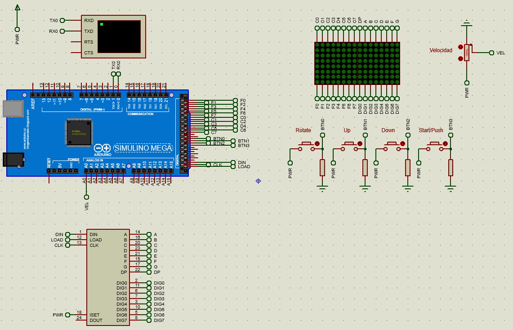


### EXPLICACION DEL CODIGO ARDUINO

#### Mensaje Inicial
Este mensaje es mostrado en la pantalla (matrices) al iniciar el dispositivo, con un desplazamiento inicial de la derecha a izquierda y e   l cual muestra el siguiente mensaje: “*^PRAC1-GRUPO12-SECC A^*”. Este desplazamiento lo hace columna a columna. Por ejemplo, si se mostrara la letra “P”: <br>
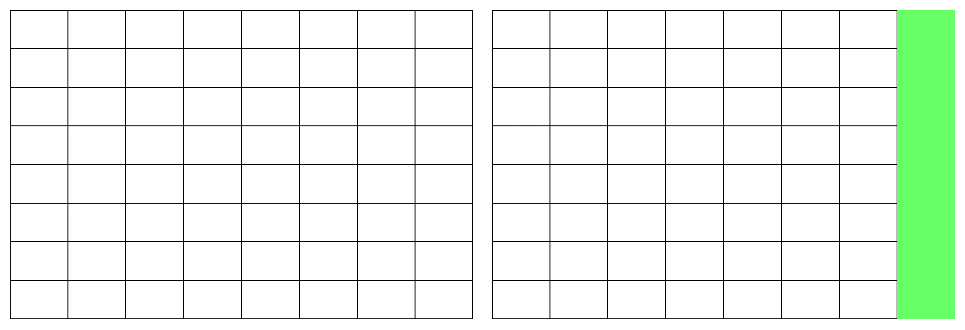
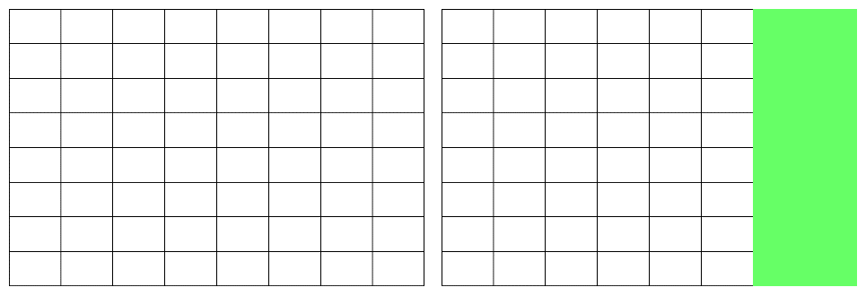
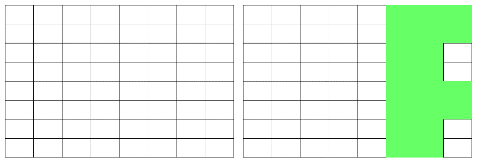
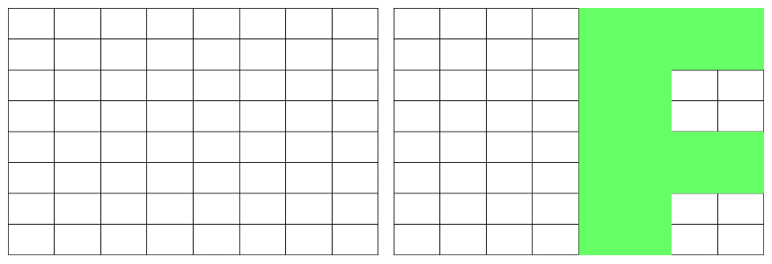
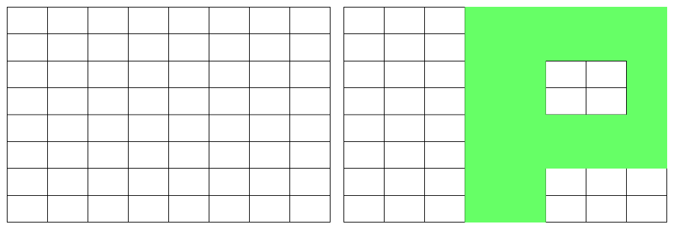
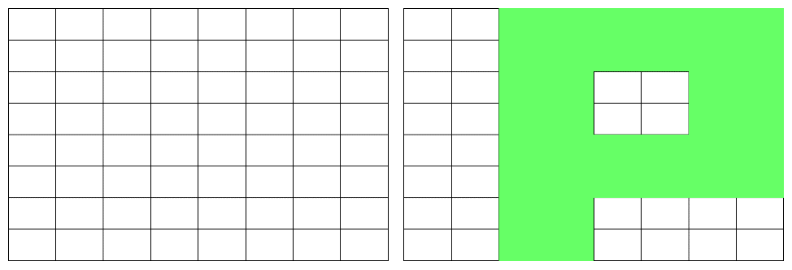


#### Clase Mensaje
##### **Atributos**
```c++
byte letrero[192];
bool or_normal = true;
int indice = 0;
long unsigned t_last_mov;
int contador = 0;
```
* letrero[192]: es un arreglo que almacena en un rango de 8 posiciones una columna que representa una parte de una letra en especiífico.

* or_normal: tiene un valor de true cuando la direccion del desplazamiento del letrero va de derecha a izquierda y tiene un valor de false cuando la dirección del desplazamiento va de izquierda a derecha.

* indice: indica el inicio del rango (un rango de longitud 8) que va a leer.

* t_last_mov: almacena el índice al inicio del último rango (de longitud 8) que se leyó.


##### **Metodos** 
```c++
Mensaje();
bool puedeAvanzar();
void avanzar();
void dibujar(byte *pantalla);
void actualizarOrientacion(bool valor);
```
* Mensaje(): constructor de la clase. Se encarga de cargar al arreglo letrero todas las columnas de todas las letras.

* puedeAvanzar(): indica si ya paso un determinado periodo de tiempo para poder seguir avanzando en la lectura de rangos.
avanzar(): incrementa el indice, a la posicion inicial del proximo rango que se va a leer.

* dibujar(byte *pantalla): almacena lo que esta está en el vector letrero a la matriz (pantalla) que se muestra en las matrices.

* actualizarOrientacion(bool valor): modifica el valor de or_normal a true o false dependiendo de la direccion del mensaje.


#### Menu Pausa
El menú de pausa servirá para que el usuario pueda realizar otra actividad sin que sea perjudicado de ninguna manera en el juego. Al estar dentro del menú, se podrá:
- Mostrar la siguiente pieza que se agregará al juego.
- Mostrar los puntos obtenidos actualmente.
- Volver a mostrar el mensaje que se mostraba al principio.
- Reanudar o Reiniciar la partida.
 
## _Variables globales_
> int filas = Arreglo de los pines de las filas de la matriz sin driver.
int columnas= Arreglo de los pines de las columnas de la matriz sin driver.
lc = Arreglo de tipo LedControl, para manejar la matriz con driver.
int temporizador = temporizador para el que se tomarán las medidas de los segundos en los que fue presionado el botón "Start".
bool cambio_pausa = booleano para saber si se presionó el botón, y cambiar entre las funciones para mostrar los puntos, y mostrar la siguiente pieza.

## _Metodos_
- setup : Metodo inicial, para iniciar los pines de las matrices.
- pausa : Metodo en el cual, al ejecutarse, se mostrará la sigueinte pieza, si se presiona el botón "Start" cambiará a mostrar el puntaje; si se presiona por 2 segundos, procederá a mostrar el mensaje inicial; a los 3 segundos reanudará el juego; a los 4 segundos reiniciará el juego, y pasados 5 segundos mostrará un mensaje de error, el cual se quitará al presionar el botón "Start".
- mostrarletras_pausa(int [][] , byte []) : como su nombre indica, nos servirá para mostrar las letras, piezas, puntaje, etc... que se tenga que mostrar, recibiendo los datos al inicio de la función "
- LimpiarMatriz : sirve para limpiar las matrices por completo.

#### Estructua Bloque

##### **Atributos**
```c++
int x, y;
```
Almacena la posición horizontal y vertical con respecto a la esquina inferior izquierda de la matriz izquierda de la pantalla. Cabe mencionar que una pieza esta compuesta de 1 a 4 bloques.

#### Estructua Pieza

##### **Atributos**
```c++
byte tipo, estado = 1;
Bloque bloques[4];
long unsigned t_last_mov;
```
* tipo: tipo de pieza (hay 6 tipos en total).
* estado: indica en qué sentido de rotación está la pieza actual.
* bloques: almacena los bloques por los que estará compuesta la pieza.
* t_last_mov: tiempo de la última pieza.

##### **Metodos** 
```c++
Pieza();
Pieza(byte tipo, Bloque bloque_0);
bool puedeAvanzar(); 
bool puedeBajar();   
bool puedeSubir();   
bool puedeRotar();  
void avanzar();      
void subir();
void bajar();
void rotar();
void dibujar(byte pantalla[]);
void asignarCoordenadas();
void verificarCoordenadas();
```

* asignarCoordenadas(): asigna una posición inicial a cada bloque por el que está compuesto una pieza dependiendo del tipo que es.
* verificarCoordenadas(): valida que la pieza no sobrepase la posición máxima vertical y horizontal.
* avanzar(): incrementa en uno la posición horizontal de cada bloque por el que está compuesta una pieza.
* subir(): aumenta en uno, la posición vertical de cada bloque por el que está compuesta una pieza 
* bajar(): disminuye en uno, la posición vertical de cada bloque por el que está compuesta una pieza.
* dibujar(byte *pantalla): recibe como parametro la pantalla (matriz que almacena el estado lógico de cada led) y almacena en ella una determinada pieza.

#### Clase Juego
##### **Atributos**
```c++
Pieza pieza_actual, pieza_siguiente;
```

##### **Metodos** 
```c++
Juego();
void iniciar();
void generarPieza();
void dibujar(byte *pantalla);
```

* iniciar(): genera la pieza que va a mostrar en el momento y la pieza siguiente.
* generarPieza(): genera una posición vertical aleatoria, asi como también la posición de la pieza actual y la siguiente.

#### Clase Tablero
##### **Atributos**
```c++
bool TableroBool[16][8];
unsigned char vectorColision[4], vectorColisionA[4];
unsigned char TableroByte[16];
int   Punteo,ColumnaPieza5,Error;
```
* bool TableroBool[16][8]: Variable conteniendo los estados de las casillas valores 0/1 o false/true ;

* unsigned char TableroByte[16]: vector con de 16 casillas unsigned char contiendo los estados de las   casillas ;

* int   Punteo: variable conteniendo el puntaje del juego; 

* int  ColumnaPieza5: variable a donde salta la pieza 5 ;

##### **Metodos** 
* bool getValorCelda(int _Fila,int _Columna): retorna el valor de la casilla con posición _Fila, _Columna, si hay un error se asigna  un valor de error ;

* void setValorCelda(int _Fila, int _Columna, bool _Valor) : Asigna  el valor de la casilla con posición _Fila, _Columna, si hay un error se asigna  un valor de error ;

* int getPunteo(): retorna el valor del punteo, suma a uno cada vez que se  completa una columna;

* void correrColumnas(): corre todas las columnas que existen si la columna cero es completada; 

* void verificaColumnaCompletada(): verifica si la columna esta completa y realiza el corrimiento  de las columnas ;
* void initTablero(): inicia los valores de la clase Tablero;

* bool verificaColision(int _NoPieza, int _Fila, int _Columna, int _Posicion): verifica si el siguiente movimiento existe colisión parámetros el numero de pieza (Ver figura 1), la posición actual la casilla principal de cada figura (Ver figura 1 la que tiene el asterisco es la casilla de control) por último la posición (de rotación) en el espacio, ver la figura 1 acá se tiene la posición;

* void dibujarPieza (int _NoPieza,int _Fila, int _Columna, int _Posicion, bool _Valor): dibuja la pieza en el tablero parámetros numero de pieza posición y valor este ultimo apaga o enciende el valor de la  pieza en el tablero

##### **Restricciones de la clase**
* Fila Inicial 0
* Fila Final 7
* Columna Inicial 0
* Columna Final 15

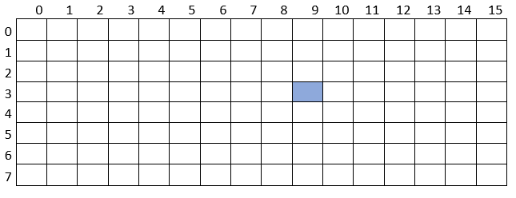

Restricción de la pieza valores aceptados de las piezas características No de pieza, _Fila y  _Columna posición de la celda de control en el tablero y Posición de rotación de la pieza ver la figura siguiente para ver el número de pieza y  posiciones disponibles de las piezas. 

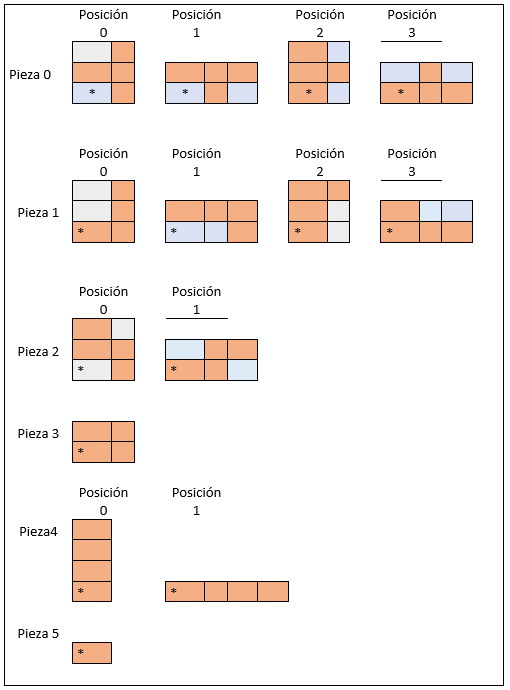
Restricción de columnas 0 -7 sin driver, de las columnas 8 a 15 con driver;

###### **Funcionamiento de colisión**
Para verificar si una pieza en el siguiente movimiento va a tener algún tipo de colisión se utiliza un vector de colisión se asignan los valores de acuerdo con la pieza si la pieza no es “solida” como, por ejemplo  

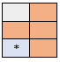

Se realizan dos verificaciones de colisión la primera con los bloques mas cercanos al inicio del tablero es decir hacia la columna como vemos en el ejemplo de la figura claramente la figura va a colisionar en el siguiente movimiento, por lo tanto no verifica a la siguiente columna de bloques

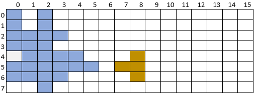

Ahora bien, veamos el siguiente caso vemos que el bloque 1 es el mas adelantado, pero este no va a colisionar por lo que se compara con la columna siguiente al cual pertenece el bloque 2 y este si colisionara con el bloque 3 

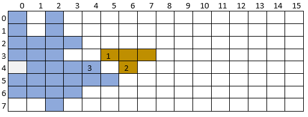

###### **Funcionamiento de columna completada y corrimiento**

Otra funcionalidad importante de la aplicación es verificar si una columna es completada veamos su funcionamiento con un ejemplo:
Veamos la figura siguiente 

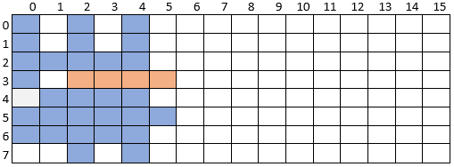

Las casillas marcadas con  el color azul son las que están ya apiladas y va a ingresando una pieza tipo 4 en posición 1 (horizontal), cuando finaliza su recorrido se debe de llamar a la función verificaColision para el siguiente movimiento como va a ver una colisión se debe de llamar a dibujar la pieza en la nueva posición con el método dibujarPieza este ya actualiza tablero de control quedando de la siguiente manera:

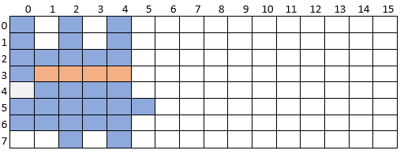

Luego de esto se debe llamar a verificaColumnaCompletada  este lo que hace es  lo siguiente recorre el vector de control si alguno es igual a 255 (recordar que el vector de control es unsigned char) en binario 1111 1111 con esto tenemos una columna completada a continuación se muestra el método

```c++
void verificaColumnaCompletada()
{
	int i,j;
	unsigned char columna;


	i = 0;
	
	do 
	{
		columna = TableroByte[i];
		if (columna == 255)
		{
			Punteo += 1;
			j = i;
			while (j < 15 && TableroByte[j])
			{
				TableroByte[j] = TableroByte[j + 1];
				j++;
			}
			columna = TableroByte[i];
			Punteo += 1;
		}
		else
		{
			i++;
		}
	} while (columna);
	setTableroBoolDeTableroByte();
}
```

Si se cumple que la columna esta completa se realiza un corrimiento donde la columna actual se asigna con la columna siguiente hasta encontrar una columna vacía y se repite el proceso hasta encontrar una columna cero. AL mismo tiempo se actualiza la variable de punteo.